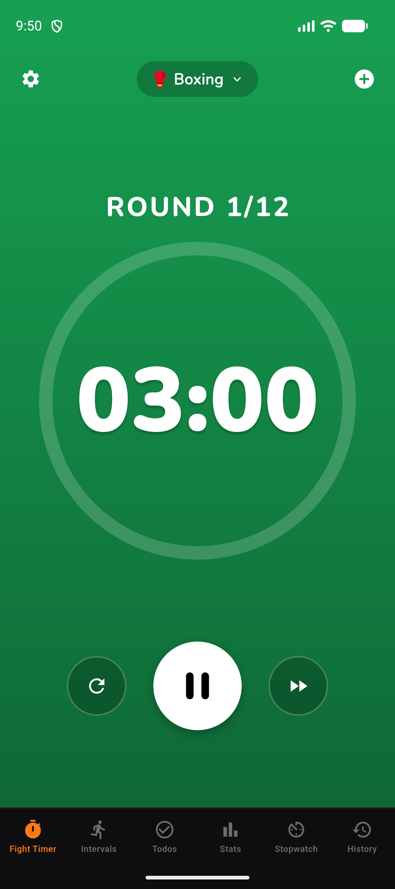
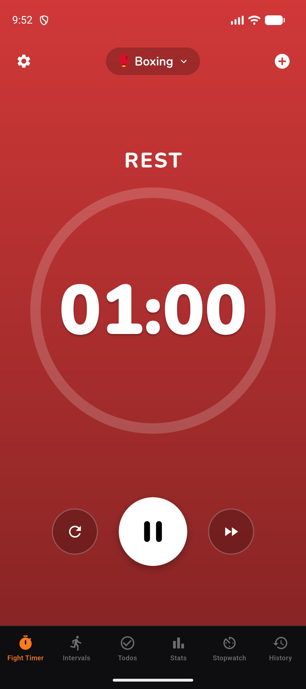
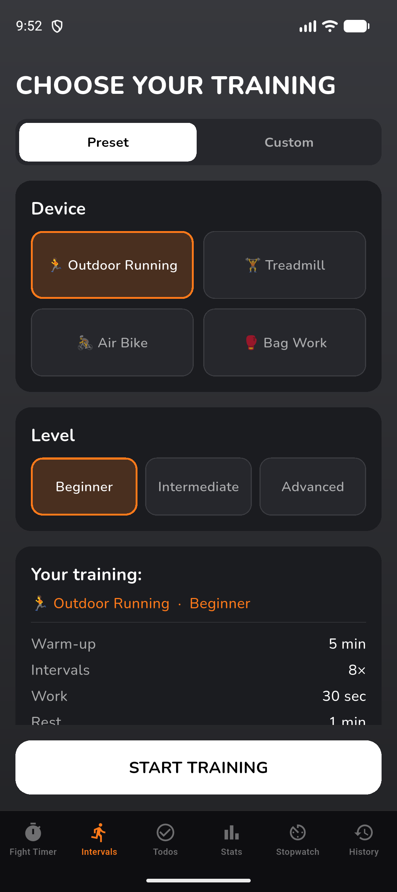
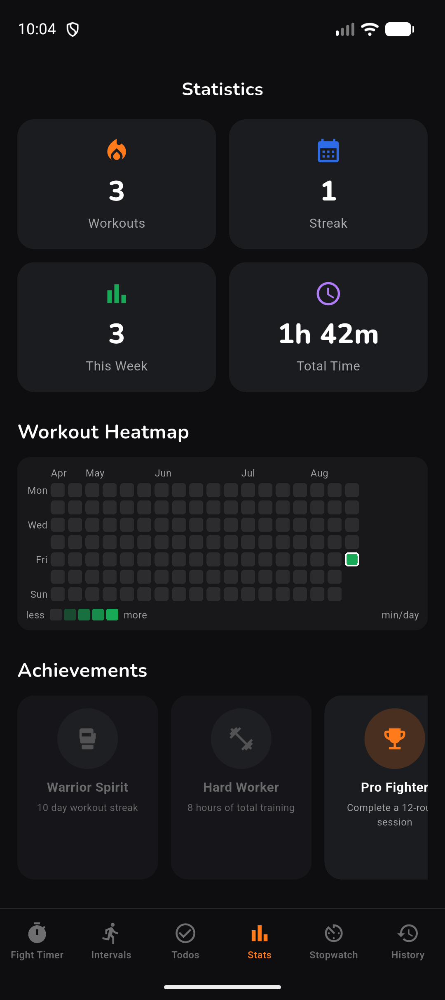
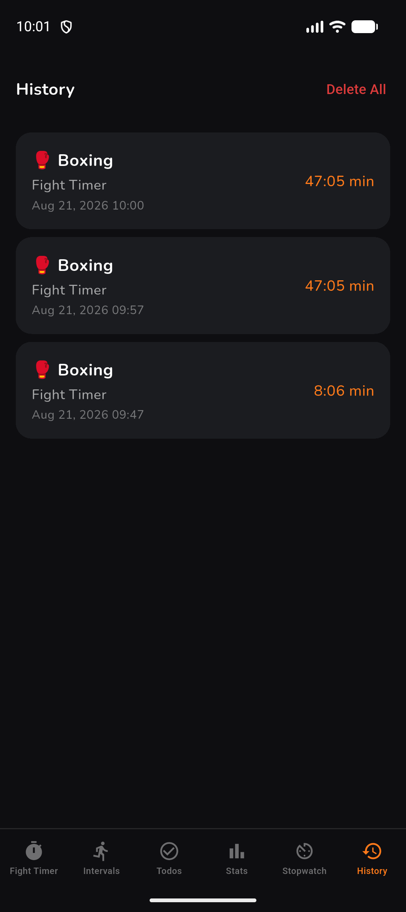
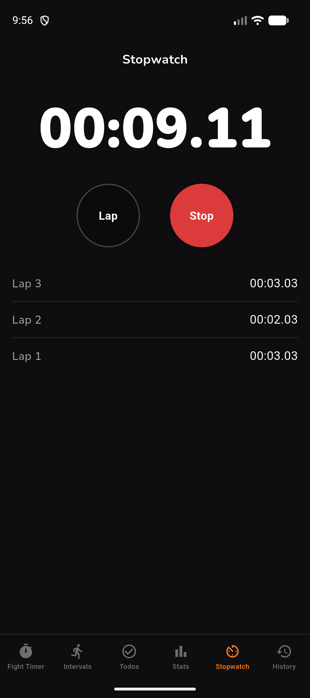

# Boxing Interval Timer — Flutter (Android)

A cross-platform rebuild of my shipped iOS app **[Boxing Interval Timer](https://github.com/mr-dzzs21/Box-Interval-Timer)** in Flutter/Dart, targeting Android with 1:1 feature and design parity. The goal: take a real, App-Store-published SwiftUI app and reproduce it faithfully on a second platform.


> **iOS original:** [mr-dzzs21/Box-Interval-Timer](https://github.com/mr-dzzs21/Box-Interval-Timer) · [App Store](https://apps.apple.com/app/id6759615674)
> **Status:** feature-complete and release-configured (signed App Bundle); Play Store submission in progress.

## Screenshots

<p align="center">
  
  
  
</p>
<p align="center">
  
  
  
</p>
<p align="center"><sub>Fight timer (round / rest — the background follows the phase) · interval setup · statistics · history · stopwatch</sub></p>

## Features

Full parity with the iOS app:

- **Fight Timer** — round/rest presets (Boxing, MMA, K1, Muay Thai, BJJ, Judo, Wrestling, Taekwondo) plus custom, savable profiles.
- **Interval Training** — configurable work/rest HIIT timers (running, treadmill, air bike, bag work) with three difficulty levels.
- **Stopwatch** with laps.
- **History & Statistics** — locally stored workouts, streaks, total time, favourite sport, weekly heatmap, and achievements.
- **Todo list** with local reminder notifications.
- **Background-safe timing**, phase-coloured UI (green = round, red = rest), round bell + 10-second warning, haptics.
- **7 languages** — English, German, Spanish, French, Russian, Portuguese, and Arabic (RTL).

## Tech Stack

| Concern | iOS original | Flutter port |
|--------|--------------|--------------|
| UI | SwiftUI | Flutter widgets |
| State | MVVM / `ObservableObject` | `provider` (`ChangeNotifier`) |
| Local database | Core Data | `sqflite` |
| Key-value storage | `UserDefaults` | `shared_preferences` |
| Audio | AVFoundation | `audioplayers` |
| Speech | AVSpeechSynthesizer | `flutter_tts` |
| Purchases | StoreKit 2 | `in_app_purchase` |
| Notifications | UserNotifications | `flutter_local_notifications` + `timezone` |
| Keep-awake | `isIdleTimerDisabled` | `wakelock_plus` |

## Architecture

- **Drift-free timer engine.** `TimerSessionEngine` (in `lib/core/`) is a pure Dart port of the iOS engine: it computes the current phase and remaining time from a start timestamp rather than a ticking counter, so the timer stays accurate across backgrounding and lock. It has no Flutter dependencies and is **unit-tested** directly.
- **Token-driven design parity.** The colours, type scale, spacing, and radii are ported 1:1 from the iOS `DesignSystem.swift` into `lib/core/design_system.dart`, so both apps share the exact same "bold/athletic" dark look — the background colour follows the timer phase.
- **Reactive data.** The `sqflite`-backed history repository is a `ChangeNotifier`; the History and Stats screens listen to it, so a workout saved on one tab appears immediately on the others without a restart.
- **Separation of concerns.** Pure logic (engine, models) is decoupled from controllers (`ChangeNotifier` view models) and widgets, which keeps the core testable.

## Tests

```bash
flutter analyze   # no issues
flutter test      # 20 passing
```

The suite covers the timer engine (phase transitions, drift-free behaviour) and key widgets, with the engine cross-checked against the original Swift implementation.

## Build & Run

Requirements: Flutter SDK (stable channel) + Android SDK / emulator.

```bash
flutter pub get
flutter run                        # debug on a connected device/emulator
flutter build appbundle --release  # signed release bundle for Google Play
```

Release signing reads credentials from an untracked `android/key.properties`; without it, release builds fall back to debug keys so the project still builds on a fresh clone.

## License

© 2026 Diyar Kaymaz. All rights reserved. See [LICENSE](LICENSE).
The source is published for portfolio and review purposes; it is not licensed for redistribution, resale, or republishing.

## Contact

box.timer.app@gmail.com
